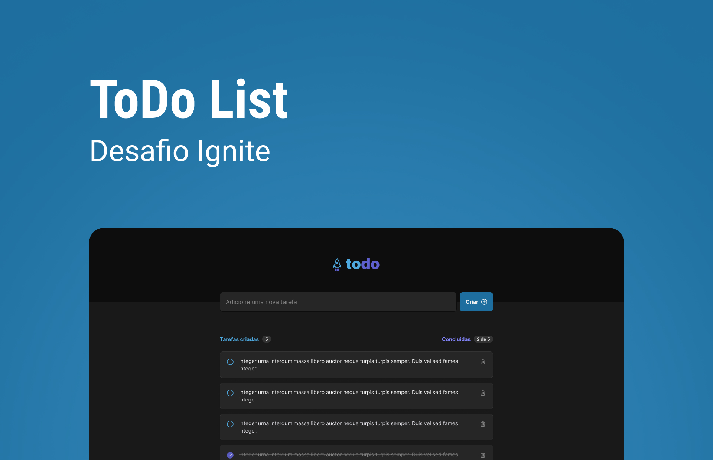

# **Desafio Ignite React 2022**

## **Desafio 01 - To-Do List**

O desafio propõe o desenvolvimento de uma aplicação To-Do utilizando alguns conceitos básicos de React, entre eles `Typescript`, `CSS Modules`

## Projeto

<a href="https://ignite-reactjs-desafio-01-one.vercel.app/" target="_blank">Todo List</a>

### Tecnologias utilizadas

- Vite
- Typescript
- CSS Modules
- Local Storage
